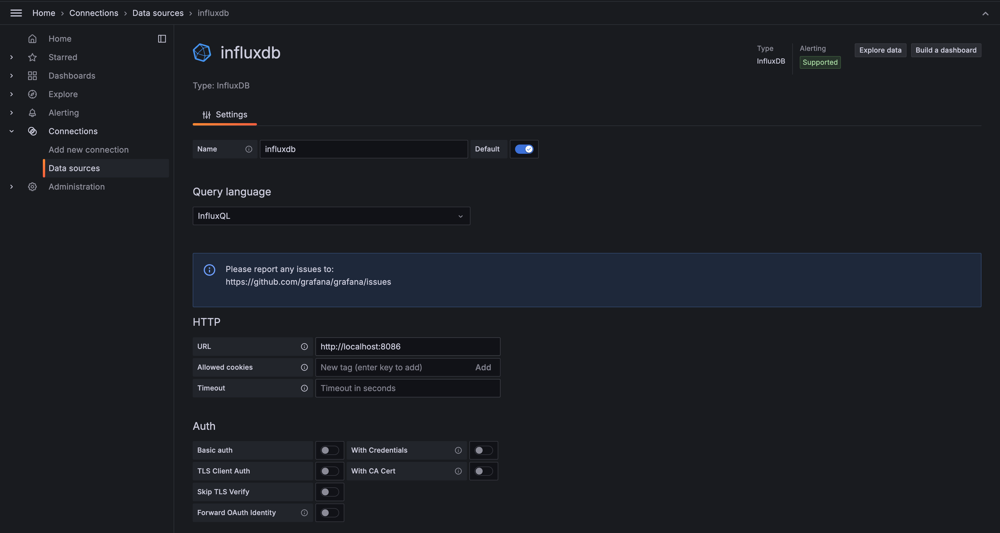
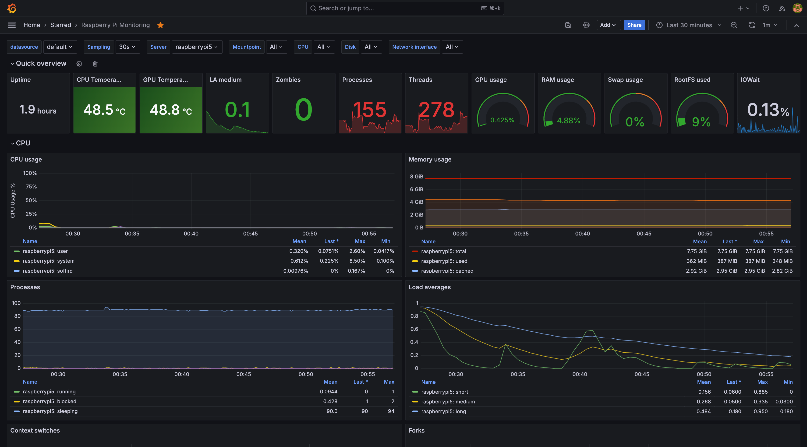

# Raspberry Pi 5 Grafana Monitoring

## Config

* OS: `Ubuntu 24.04 noble`
* Kernel: `aarch64 Linux 6.8.0-1004-raspi`
* CPU: `ARM Cortex-A76 @ 4x 3.1GHz`
* Memory: `7938MiB`

```
                          ./+o+-       
                  yyyyy- -yyyyyy+      
               ://+//////-yyyyyyo      
           .++ .:/++++++/-.+sss/`      
         .:++o:  /++++++++/:--:/-      
        o:+o+:++.`..```.-/oo+++++/     
       .:+o:+o/.          `+sssoo+/    
  .++/+:+oo+o:`             /sssooo.   
 /+++//+:`oo+o               /::--:.   
 \+/+o+++`o++o               ++////.   
  .++.o+++oo+:`             /dddhhh.  
       .+.o+oo:.          `oddhhhh+   
        \+.++o+o``-````.:ohdhhhhh+    
         `:o+++ `ohhhhhhhhyo++os:     
           .o:`.syhhhhhhh/.oo++o`     
               /osyyyyyyo++ooo+++/    
                   ````` +oo+++o\:    
                          `oo++.     
```

## Setup

1. Preparation step

  ```shell
  sudo apt-get update
  ```

2. Install `grafana` (
   source: [here](https://grafana.com/docs/grafana/latest/setup-grafana/installation/debian/#install-from-apt-repository))

  ```shell
  sudo apt-get install -y adduser libfontconfig1 musl
  wget -q -O - https://apt.grafana.com/gpg.key | gpg --dearmor | sudo tee /etc/apt/keyrings/grafana.gpg > /dev/null
  echo "deb [signed-by=/etc/apt/keyrings/grafana.gpg] https://apt.grafana.com stable main" | sudo tee /etc/apt/sources.list.d/grafana.list
  sudo apt-get update && sudo apt-get install -y grafana
  sudo systemctl daemon-reload
  sudo systemctl enable grafana-server
  sudo systemctl start grafana-server
  ```

3. Install `InfluxDB` and `telegraf`
    1. Install `InfluxDB` and `telegraf` (
       source: [here](https://docs.influxdata.com/influxdb/v1/introduction/install/#installing-influxdb-oss))
    ```shell
    wget -q https://repos.influxdata.com/influxdata-archive_compat.key
    echo '393e8779c89ac8d958f81f942f9ad7fb82a25e133faddaf92e15b16e6ac9ce4c influxdata-archive_compat.key' | sha256sum -c && cat influxdata-archive_compat.key | gpg --dearmor | sudo tee /etc/apt/trusted.gpg.d/influxdata-archive_compat.gpg > /dev/null
    echo 'deb [signed-by=/etc/apt/trusted.gpg.d/influxdata-archive_compat.gpg] https://repos.influxdata.com/debian stable main' | sudo tee /etc/apt/sources.list.d/influxdata.list
    sudo apt-get update && sudo apt-get install -y influxdb influxdb-client
    sudo apt-get update && sudo apt-get install telegraf
    ```
    2. Move configs from this repo with replace as is.
    ```shell
    sudo mv etc/telegraf/* /etc/telegraf/
    ```
    3. Grant `telegraf` user
    ```shell
    sudo usermod -G video telegraf
    ```
    4. Run services
    ```shell
    sudo systemctl unmask influxdb.service
    sudo systemctl start influxdb
    sudo systemctl reload telegraf.service
    sudo systemctl start telegraf.service
    ```
4. Configure the data sources
    1. Set `InfluxDB` http settings
       
    2. Set `telegraf` settings (P.S.: password is `telegraf_linux`)
       
5. Import dashboard from [dashboard.json](dashboard.json)
6. ???
7. PROFIT

## Result



## P.S.:

Source: https://grafana.com/grafana/dashboards/10578-raspberry-pi-monitoring/

This dashboard contains multiples sections with the goal to monitor a full Raspberry Pi board or boards, we have some
sections to monitor the Linux and machine overall performance, and temperature.
[Special thanks to Lex Rivera for his Linux System dashboard](https://grafana.com/orgs/lex)